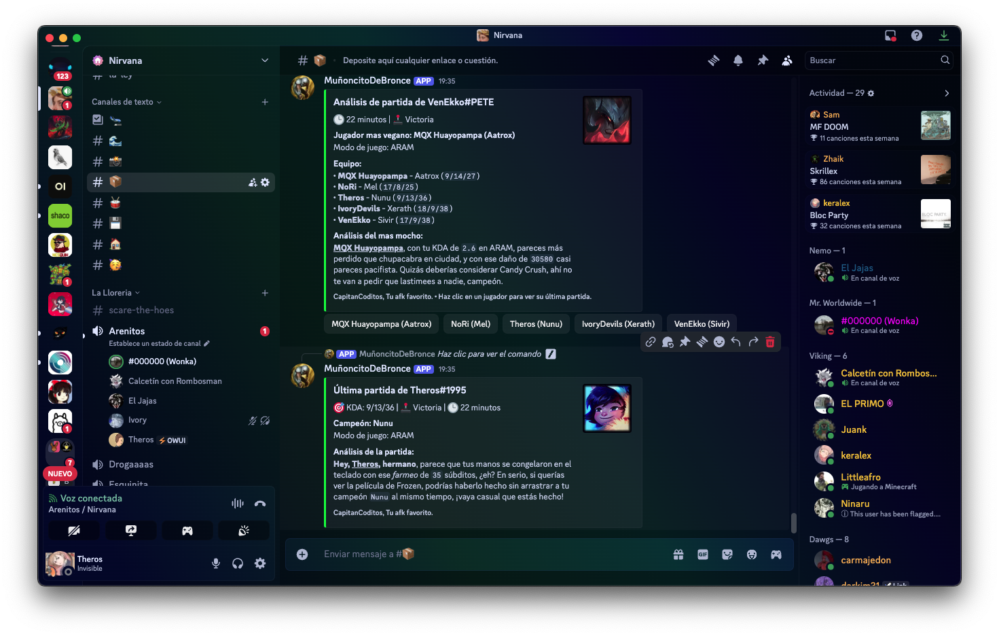

# Capitán Coditos - Discord League of Legends Bot

A Discord bot that provides League of Legends match analysis using the Riot API and OpenAI for entertaining match summaries.

Built on a microservices architecture: a **Flask REST API** handles all data fetching and processing, a **Discord bot** acts as a thin client, and **Celery** workers run heavy tasks in the background. Match data is cached in **MongoDB** and **Redis** to minimize Riot API calls.

## 🎨 Teaser Images




---

## 🏗️ Architecture

```
┌─────────────────────────────────────────────────────────┐
│                     Docker Network                      │
│                                                         │
│  ┌──────────┐   HTTP    ┌────────────────────────────┐  │
│  │  Discord │ ────────► │     Flask API (api/)       │  │
│  │  Bot     │           │  Routes / Services / DB    │  │
│  │  (bot/)  │           └──────────┬─────────────────┘  │
│  └──────────┘                      │                    │
│                           ┌────────┴────────┐           │
│                     ┌─────▼─────┐   ┌───────▼──────┐   │
│                     │  MongoDB  │   │    Redis     │   │
│                     │  (data)   │   │ (cache+queue)│   │
│                     └───────────┘   └──────┬───────┘   │
│                                            │            │
│                               ┌────────────▼──────────┐ │
│                               │   Celery Workers      │ │
│                               │ (worker + beat)       │ │
│                               └───────────────────────┘ │
└─────────────────────────────────────────────────────────┘
```

### Services

| Container | Image | Role |
|---|---|---|
| `capitan-api` | `./api` | Flask REST API + Gunicorn (port 5000) |
| `capitan-celery-worker` | `./api` | Celery task worker (concurrency=2) |
| `capitan-celery-beat` | `./api` | Celery periodic task scheduler |
| `capitan-coditos` | `./bot` | Discord bot (thin HTTP client) |
| `capitan-mongo` | `mongo:7` | Match data & summoner profiles |
| `capitan-redis` | `redis:7-alpine` | L1 cache + Celery broker/backend |

---

## 🌐 Web Dashboard

The API exposes a single-page web dashboard at `http://localhost:5001/` (or your server IP on port 5001 in production).

It is a **vanilla JS + Tailwind CDN** app — no build step required. The UI is split across four static files loaded in dependency order:

| File | Responsibility |
|---|---|
| `static/js/constants.js` | Global constants (`DD`, `TIER_COLOR`, queue maps) and pure formatting helpers |
| `static/js/components.js` | Pure component functions returning HTML strings (`StatsRow`, `MatchCard`, `TeamTable`, skeletons…) |
| `static/js/mobile.js` | Mobile-first panel navigation (`setMobilePanel`, `isMobile`) |
| `static/js/app.js` | App state, all render/API functions, event wiring, and bootstrap calls |

Features:
- Summoner list with region editing and search
- Match history timeline (ranked / normal / ARAM filter tabs)
- Per-summoner profile: champion grid, win-rate doughnut chart, rank badge
- **Win Rate con Amigos** — in-profile section showing W/L and win-rate vs each friend who played on the same team
- Match detail view: team tables with damage/gold bars and AI analysis
- Duration distribution chart (Chart.js bar + line combo, powered by Celery task)
- Animated champion splash background and live sync progress bar
- Fully responsive — works on desktop and mobile

> **Cache-busting:** The four `<script>` tags in `api/templates/index.html` carry a `?v=N` suffix (currently `v=4`). Increment `N` whenever a `.js` file changes, then rebuild the API container so browsers fetch the latest code.

---

## 📁 Project Structure

```
capitan-coditos/
├── api/                        # Flask REST API
│   ├── app.py                  # Application factory
│   ├── config.py               # Environment config
│   ├── Dockerfile
│   ├── requirements.txt
│   ├── database/
│   │   ├── match_cache.py      # Redis + MongoDB cache-aside layer
│   │   └── summoners.py        # Summoner registry (MongoDB)
│   ├── routes/
│   │   ├── ai.py               # POST /api/ai/analyze
│   │   ├── db.py               # GET  /api/db/summoners/*
│   │   ├── summoner.py         # GET  /api/summoner/*
│   │   └── tasks.py            # POST /api/tasks/* (enqueue + poll)
│   ├── services/
│   │   └── riot_api.py         # Riot API wrappers + match logic
│   ├── static/
│   │   └── js/
│   │       ├── constants.js    # Data constants + formatting utilities (DD, TIER_COLOR, fmtDuration…)
│   │       ├── components.js   # Pure UI component functions + skeleton helpers
│   │       ├── mobile.js       # Mobile panel navigation (setMobilePanel)
│   │       └── app.js          # App state, render logic, API calls, event wiring
│   ├── tasks/
│   │   ├── celery_app.py       # Celery configuration
│   │   ├── duration_stats.py   # Game duration breakdown task
│   │   ├── matchups.py         # Champion matchup analysis task
│   │   ├── prefetch.py         # Background match prefetch task
│   │   └── worst_games.py      # Worst games analysis task
│   └── templates/
│       └── index.html          # Web dashboard shell (loads static JS files)
│
├── bot/                        # Discord bot (thin client)
│   ├── bot.py                  # Bot entry point
│   ├── Dockerfile
│   ├── requirements.txt
│   ├── commands/
│   │   ├── analizarpartida.py  # /analizarpartida
│   │   ├── dbstats.py          # /dbstats
│   │   ├── duracionpartidas.py # /duracionpartidas
│   │   ├── historialpartidas.py# /historialpartidas
│   │   ├── matchups.py         # /matchups
│   │   ├── ultimapartida.py    # /ultimapartida
│   │   └── worstgames.py       # /worstgames
│   ├── riot/
│   │   └── active_game_notify.py # Periodic in-game detection
│   └── utils/
│       ├── api_client.py       # aiohttp client + task polling
│       ├── autocomplete.py     # Slash command autocomplete
│       └── embed_builders.py   # Discord embed helpers
│
├── app/                        # Legacy monolith (reference only)
├── scripts/                    # Utility scripts
│   └── etl_postgres_to_mongo.py# One-time Postgres → MongoDB migration
├── docker-compose.prod.yml     # Production stack
├── docker-compose.yml          # Development stack
└── .env                        # Environment variables
```

---

## 🎮 Commands

| Command | Description |
|---|---|
| `/ultimapartida` | Last match stats with AI-powered commentary |
| `/analizarpartida` | Team analysis — finds and roasts the worst performer |
| `/historialpartidas` | Match history with KDA, damage, and win/loss |
| `/matchups` | Champion matchup breakdown by role/lane |
| `/worstgames` | Worst-performing games ranked by KDA and damage |
| `/duracionpartidas` | Game duration distribution across configurable buckets |
| `/dbstats` | Internal DB stats (summoner count, cached matches) |

---

## 🚀 Deployment

### Prerequisites

- Docker & Docker Compose
- A `.env` file with all required variables (see below)

### Start the stack

```bash
# Clone the repo
git clone https://github.com/SamuelCarmona83/capitan-coditos.git
cd capitan-coditos

# Create .env from example and fill in your keys
cp .env.example .env

# Build and start all services
docker compose -f docker-compose.prod.yml up -d --build

# Verify everything is running
docker compose -f docker-compose.prod.yml ps
```

### Update after a code change

```bash
docker compose -f docker-compose.prod.yml up -d --build
```

### View logs

```bash
# All services
docker compose -f docker-compose.prod.yml logs -f

# Specific service
docker logs -f capitan-api
docker logs -f capitan-coditos
docker logs -f capitan-celery-worker
```

---

## ⚙️ Environment Variables

Create a `.env` file in the project root:

```env
# Discord
DISCORD_TOKEN=your_discord_bot_token

# Riot Games
RIOT_API_KEY=your_riot_api_key

# OpenAI
OPENAI_API_KEY=your_openai_api_key

# MongoDB
MONGO_URL=mongodb://mongo:27017
MONGO_DB=capitancoditos

# Redis
REDIS_URL=redis://redis:6379/0
```

| Variable | Description | Required |
|---|---|---|
| `DISCORD_TOKEN` | Discord bot token | ✅ |
| `RIOT_API_KEY` | Riot Games API key | ✅ |
| `OPENAI_API_KEY` | OpenAI API key for AI commentary | ✅ |
| `MONGO_URL` | MongoDB connection string | ✅ |
| `MONGO_DB` | MongoDB database name | ✅ |
| `REDIS_URL` | Redis connection string | ✅ |

---

## 🔧 Setup Requirements

### Discord Bot

1. Go to the [Discord Developer Portal](https://discord.com/developers/applications)
2. Create a new application → Bot → copy the token
3. Enable **Server Members Intent** and **Message Content Intent**
4. Invite the bot to your server with `applications.commands` and `bot` scopes

### Riot API Key

1. Visit the [Riot Developer Portal](https://developer.riotgames.com/)
2. Generate a personal API key (or apply for a production key for long-term use)

### OpenAI API Key

1. Visit [OpenAI Platform](https://platform.openai.com/api-keys)
2. Create a new secret key

---

## 🐛 Troubleshooting

| Problem | Solution |
|---|---|
| Bot is offline | `docker logs capitan-coditos` — check token and API connectivity |
| Commands not appearing in Discord | Wait ~1 hour for global slash command propagation, or use guild commands |
| Riot API 404 errors | Summoner region may be missing — run any command with the correct region to auto-store it |
| Task stuck in PENDING | `docker logs capitan-celery-worker` — verify worker connected to Redis |
| Port 5000 busy on macOS | macOS AirPlay uses 5000; prod compose maps host port 5001→5000 |

---

## 🔗 Links

- [Discord Developer Portal](https://discord.com/developers/applications)
- [Riot Developer Portal](https://developer.riotgames.com/)
- [OpenAI Platform](https://platform.openai.com/)

---

Made with ❤️ for the League of Legends community
